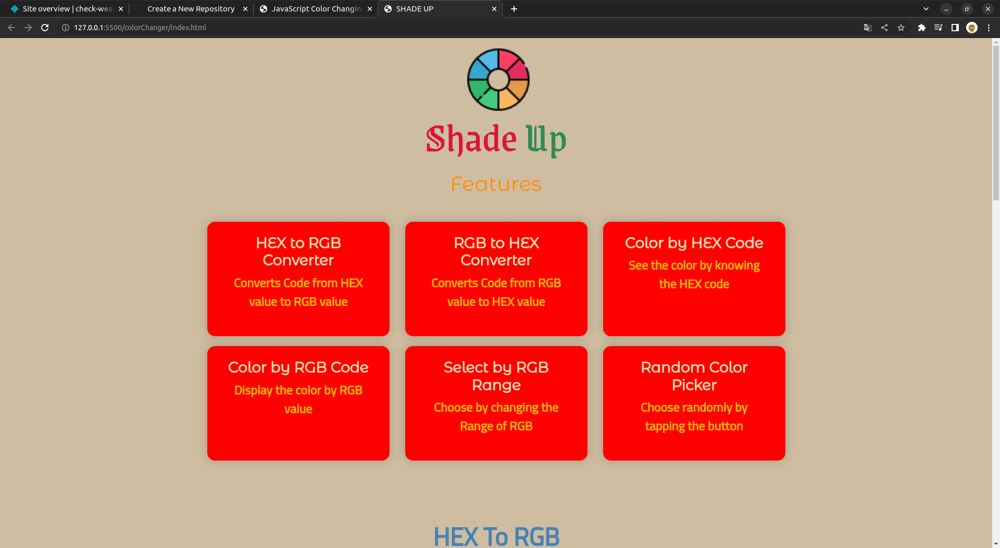
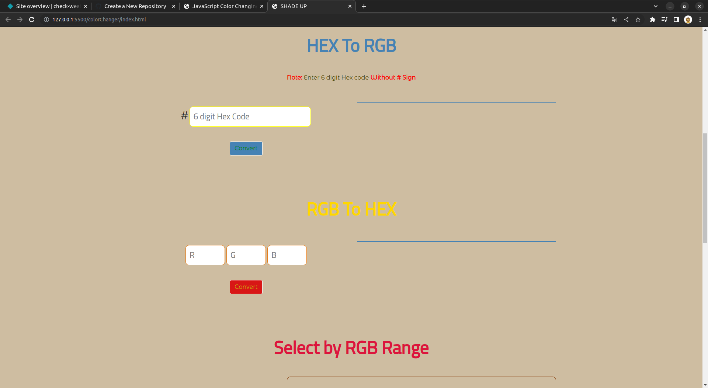
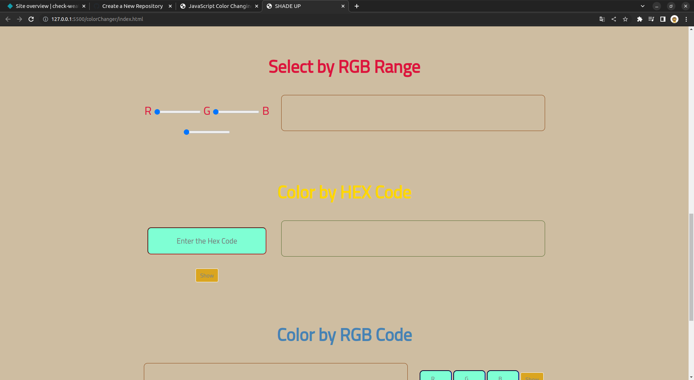
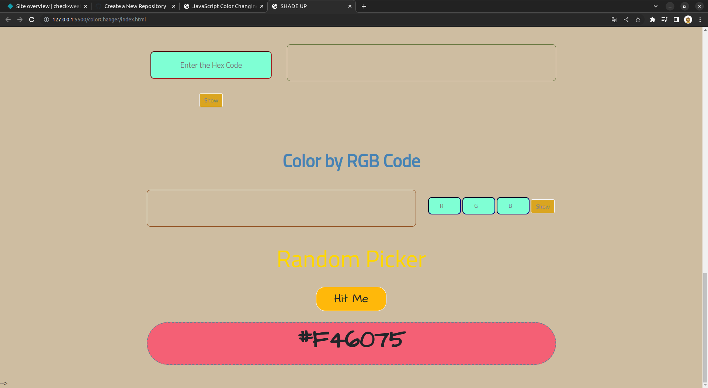

# Shade-Up-App | React.js

By Prince Kr Paswan

## [Link to the Weather-App](https://check-weather-prince.netlify.app/)

## How it will help you?

It gives you various option to play 
wil colour and colour hexa code 

## This project took around 3 hours to complete.